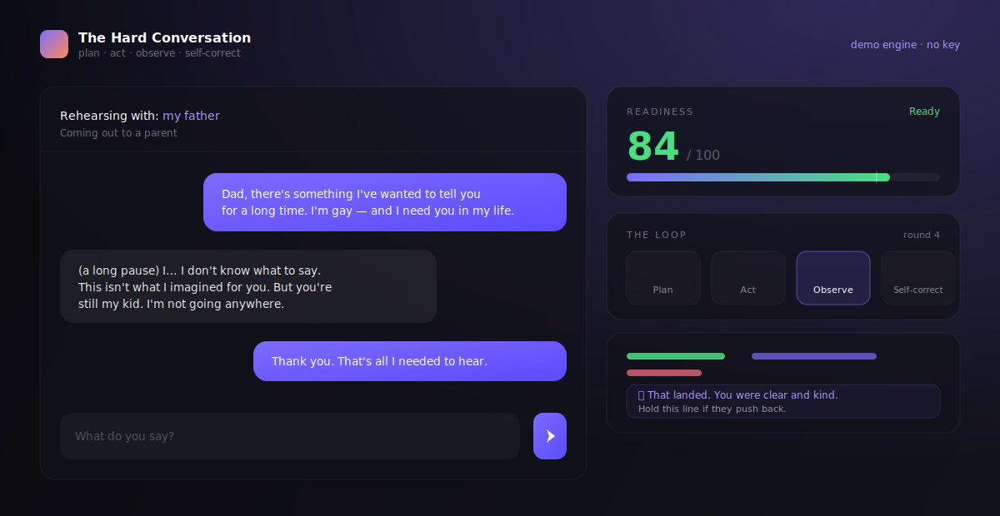
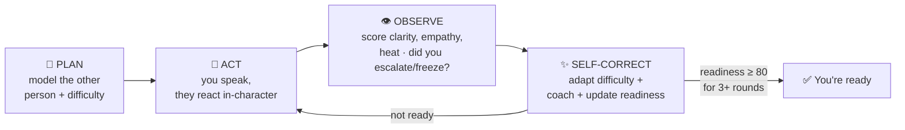

<div align="center">



# Circles

**Rehearse the talk you're dreading — with an agent that role-plays the other person, watches where you break, and coaches you until you're ready.**

A self-directing agent loop: **plan → act → observe → self-correct**, running until it decides *you're* ready.

[](https://github.com/vnmoorthy/circles/actions/workflows/ci.yml)
[](https://github.com/vnmoorthy/circles/actions/workflows/deploy.yml)
[](https://vnmoorthy.github.io/circles/)
[](LICENSE)
[](#tech)
[](docs/SPONSORS.md)

### [▶ Try the live demo](https://vnmoorthy.github.io/circles/) &nbsp;·&nbsp; [The loop, explained](docs/LOOP.md) &nbsp;·&nbsp; [Architecture](docs/ARCHITECTURE.md) &nbsp;·&nbsp; [Sponsors](docs/SPONSORS.md)

</div>

---

## Why

Everyone has a conversation they keep not having. Coming out to a parent. Quitting a job you're loyal to. Telling your kid you're sick. Ending something with someone you still love.

You rehearse it in the shower and it falls apart the moment the other person reacts in a way you didn't script. **Circles** gives you the reps: an agent plays the other person — defensive, tearful, guilt-tripping, whatever they'll actually be — and after every line you say, a second pass tells you *exactly* where it landed and how to say it better. It loops until it's confident you can walk in.

It is, quite literally, a build-cycle loop pointed at the hardest thing to build: the courage to say the thing.

## The loop

This isn't a chatbot with a loop bolted on. The loop **is** the product, and it's on screen the whole time.



- **PLAN** builds a persona and a difficulty model from your spec.
- **ACT** is your turn; the persona replies *in character*.
- **OBSERVE** is a separate analytical pass over **your** message — clarity, empathy, emotional temperature, whether you escalated or froze.
- **SELF-CORRECT** is where it earns the name: the persona's difficulty **adapts** to keep you in your zone (harder when you're handling it, gentler when you're floundering), you get concrete coaching, and a **Readiness** score updates. When readiness holds above threshold, the loop *decides on its own* that you're done.

Full write-up: **[docs/LOOP.md](docs/LOOP.md)**.

## What makes it demo-proof

- **🎛 The loop is legible.** A live four-phase timeline lights up each round, and a Readiness meter climbs toward the convergence line. You can *watch* it self-correct.
- **🔧 Throw a wrench — live.** Hand a judge the "throw a wrench" bar and let them make the other person suddenly rage, cry, or guilt-trip. The loop copes in real time. This is the money moment.
- **🔒 Private by construction.** The demo engine runs **entirely in your browser** — nothing you type ever leaves the device. A [Pomerium-style guard](docs/SPONSORS.md#pomerium) redacts PII and gates egress for the real models.
- **🧪 Deterministic core.** All the loop math is pure and unit-tested (37 tests), so behaviour is reproducible on stage.

## Sponsors, natively integrated

| Sponsor | How it's used |
| --- | --- |
| **AWS (Bedrock)** | First-class model provider — Claude on Bedrock via a signing proxy (`server/bedrock-handler.ts`) so AWS creds never touch the browser. |
| **Pomerium** | The privacy model: identity-aware, policy-gated egress for intensely sensitive conversation data. Client-side guard ships today; runtime enforcement is the deploy story. |
| **Akash** | Target for private, low-cost hosting of the model proxy — sensitive workloads on open compute. |

Details and deployment notes: **[docs/SPONSORS.md](docs/SPONSORS.md)**.

## Quickstart

```bash
git clone https://github.com/vnmoorthy/circles.git
cd circles
npm install
npm run dev          # http://localhost:5173
```

That's it — the app runs on the **demo engine** with no API key and no network calls.

### Use a real model (optional)

Open **Model** (top right) and pick a provider:

- **Claude (Anthropic):** paste your `sk-ant-…` key. It's stored only in your browser and sent directly to `api.anthropic.com`.
- **AWS Bedrock:** deploy the proxy in [`server/bedrock-handler.ts`](server/bedrock-handler.ts) and paste its URL.

Highly-sensitive conversations stay on-device unless you explicitly opt in to sending redacted context off-device — see **Privacy** below.

## Privacy

The conversations people rehearse here are among the most sensitive things they'll ever type. So:

1. The **demo engine never egresses** — it's pure client-side heuristics.
2. Real providers only ever receive **PII-redacted** text (emails/phones/SSNs/cards scrubbed).
3. High-sensitivity topics (health, sexuality, abuse, custody…) are **blocked from leaving the device** unless you flip an explicit per-session consent.
4. Only your *settings* persist to `localStorage`. **The conversation itself is never stored.**

## Tech

<a name="tech"></a>

- **Vite + React 18 + TypeScript** (strict), **Tailwind**, **Framer Motion**, **Zustand**
- Pure, provider-agnostic **loop engine** (`src/lib/engine`)
- Pluggable **providers**: `mock` (in-browser), `anthropic`, `bedrock` (`src/lib/providers`)
- **Vitest** unit suite · **GitHub Actions** CI + Pages deploy

```
src/
├── lib/
│   ├── engine/      # pure loop: types, readiness math, state transitions
│   ├── providers/   # mock · anthropic · bedrock · shared prompt/parse
│   ├── guard.ts     # PII redaction + sensitivity + egress policy
│   └── scenarios.ts # preset conversations + curveballs
├── state/           # zustand store: orchestrates a round + phase animation
└── components/      # ReadinessMeter · LoopTimeline · RoundInsight · …
server/
└── bedrock-handler.ts   # reference AWS signing proxy
```

## Scripts

| Command | Does |
| --- | --- |
| `npm run dev` | Dev server |
| `npm test` | Run the Vitest suite |
| `npm run typecheck` | `tsc` in strict mode |
| `npm run build` | Production build |

## Roadmap

- Voice mode (speak your lines; hear the persona)
- Post-session debrief: your patterns across rehearsals
- Nexla-fed signal loops (reply-rate style outcomes) for workflow variants
- Shareable, self-hostable persona packs

## License

[MIT](LICENSE) © 2026

<div align="center"><sub>Built for the Loop Engineering Hackathon. Your rehearsal never leaves your device on the demo engine.</sub></div>
