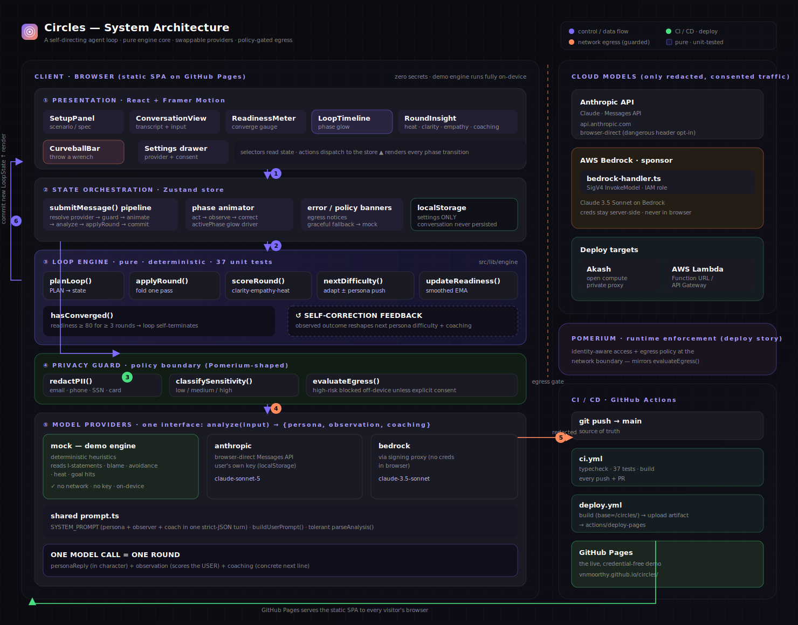

# Architecture

A single-page app with a **pure loop engine** at its center and **swappable
model providers** at its edge. No backend is required for the demo; a tiny proxy
is only needed if you want AWS Bedrock.



> Full-resolution, always up to date at [`/architecture.svg`](https://vnmoorthy.github.io/circles/architecture.svg).

```
┌──────────────────────────────────────────────────────────────┐
│  React UI (components/)                                       │
│  SetupPanel · ConversationView · ReadinessMeter ·            │
│  LoopTimeline · RoundInsight · CurveballBar · Settings       │
└───────────────▲───────────────────────────┬──────────────────┘
                │ selectors                  │ actions
┌───────────────┴───────────────────────────▼──────────────────┐
│  Zustand store (state/store.ts)                              │
│  • resolves the active Provider from Settings               │
│  • runs the guard's egress policy before any real call      │
│  • redacts PII on outbound text                             │
│  • animates ACT → OBSERVE → SELF-CORRECT phases             │
└───────────────┬───────────────────────────┬──────────────────┘
                │                            │
     ┌──────────▼─────────┐      ┌───────────▼──────────────┐
     │ Loop engine        │      │ Providers                │
     │ (lib/engine/)      │      │ (lib/providers/)         │
     │ • planLoop         │      │ • mock   (in-browser)    │
     │ • applyRound       │      │ • anthropic (browser)    │
     │ • readiness math   │      │ • bedrock  (via proxy) ──┼──▶ server/bedrock-handler.ts
     │ PURE · TESTED      │      │ shared prompt + parser   │
     └────────────────────┘      └──────────────────────────┘
                                            │
                                 ┌──────────▼───────────┐
                                 │ Guard (lib/guard.ts) │
                                 │ redact · classify ·  │
                                 │ egress policy        │
                                 └──────────────────────┘
```

## Layers

### `lib/engine` — the brain (pure, no I/O)

- **`types.ts`** — the domain model (`ConversationSpec`, `Observation`, `RoundRecord`, `LoopState`, …).
- **`readiness.ts`** — `scoreRound`, `updateReadiness`, `nextDifficulty`, `hasConverged`. This is the self-correction math, heavily unit-tested.
- **`loop.ts`** — `planLoop` (PLAN) and `applyRound` (fold one ACT→OBSERVE→SELF-CORRECT pass). Pure transitions, deterministic given the model's output.

Keeping this layer free of I/O is the key design decision: the loop's behaviour
is reproducible and testable, and it runs identically client- or server-side.

### `lib/providers` — the edge (does the model work)

A `Provider` has one method, `analyze(input) → TurnAnalysis`, returning the
persona reply + observation + coaching in a single round-trip.

- **`mock.ts`** — deterministic in-browser heuristics. No network, no key. Powers the public demo and keeps stage behaviour predictable.
- **`anthropic.ts`** — Claude via the browser-direct Messages API (user's own key).
- **`bedrock.ts`** — Claude on AWS Bedrock via a signing proxy.
- **`prompt.ts`** — shared system/user prompt builder + a tolerant JSON parser used by both LLM providers.

### `lib/guard.ts` — the policy boundary

PII redaction, sensitivity classification, and an egress decision. The store
consults it **before** any provider call, mirroring where Pomerium would sit at
the runtime boundary in a deployed system.

### `state/store.ts` — orchestration

The only stateful, effectful layer. It sequences a round, drives the phase
animation, applies the guard, and persists **settings only** (never the
conversation) to `localStorage`.

### `components/` — presentation

Dumb-ish components fed by store selectors. The three that carry the "loop is
real" message are `ReadinessMeter`, `LoopTimeline`, and `RoundInsight`.

## Data flow for one round

1. User submits a message → `store.submitMessage`.
2. Store resolves provider, classifies sensitivity, evaluates egress policy.
3. If allowed: redact PII (real providers), animate `ACT → OBSERVE`.
4. `provider.analyze()` returns `{ personaReply, observation, coaching }`.
5. Animate `SELF-CORRECT`; `applyRound()` computes new readiness/difficulty/convergence.
6. Store commits the new `LoopState`; UI reflects it. Curveball (if any) is consumed.

## Why a static SPA

The demo has to be a **real, credential-free live link** for judges. A fully
client-side app on GitHub Pages achieves that: zero secrets, zero server, and
the pure engine means the in-browser demo is not a toy mock of the logic — it's
the *same* logic the server path uses, just with a different provider plugged in.
